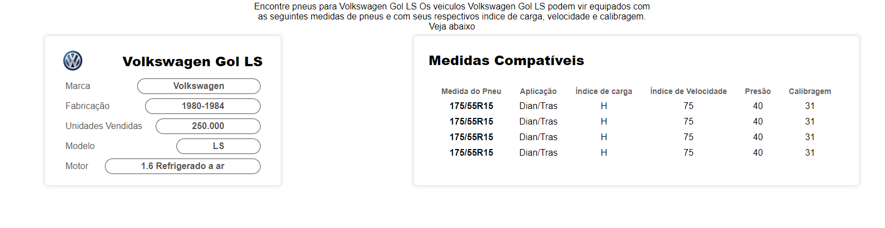
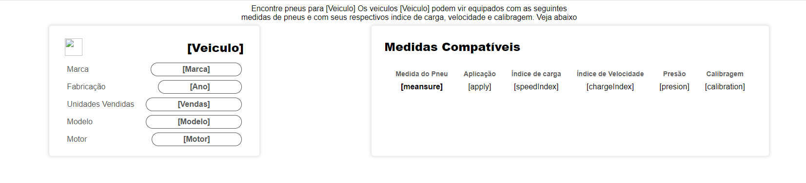
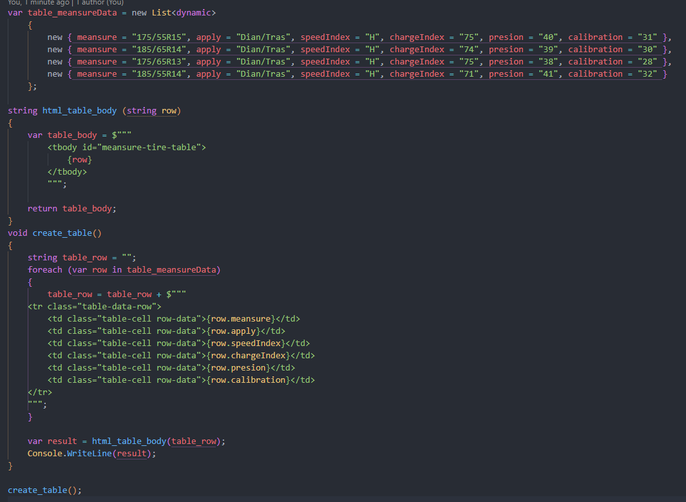
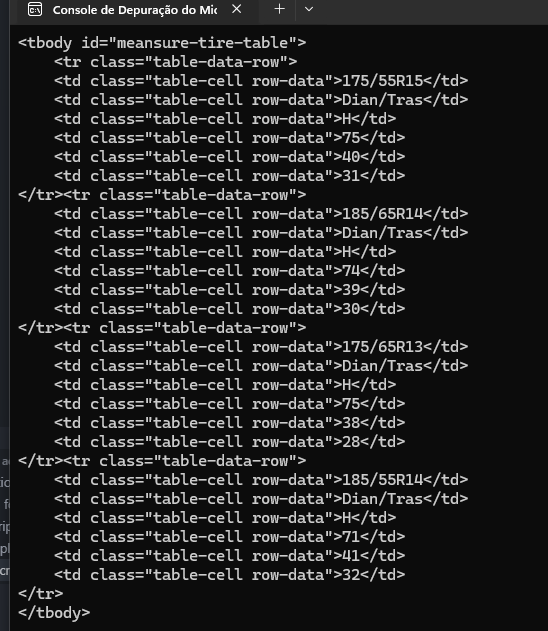

# Variables

#### Índice

- [Veiculo](#Veiculo)
- [Marca](#Marca)
- [Ano](#Ano)
- [Vendas](#Vendas)
- [Modelo](#Modelo)
- [Motor](#Motor)
- [ImagemMarca](#ImagemMarca)
- [tableMeansureData (List< TireMeansureData >)](#tableMeansureData)
  - [[meansure]](#meansure)
  - [[apply]](#apply)
  - [[chargeIndex]](#chargeIndex)
  - [[speedIndex]](#speedIndex)
  - [[presion]](#presion)
  - [[calibration]](#calibration)
- [HTMLTableElement.tbody tableBody](#tableBody)
- [HTMLTableElement.rows tableRows](#tableRows)
  - [HTMLElements dataCallback](#dataCallback)
    - [TireMeansureData Obj](#Obj)
- [CSharp tbody gen](#tbody-gen)

### Veiculo

Referente ao nome completo do veiculo. Ex: "Volkswagen Gol LS".

### Marca

O nome da marca do Veiculo. Ex: "Volkswagen"

### Ano

Ano de manufaturação do carro, referente ao ano de inicio e o ano de final da produção dos veiculos referentes. Ex: "1980-1986"

### Vendas

Numero total de vendas que possui o carro em questão. Ex: "250.000"

### Modelo

Modelo específico ao carro promocionado. Ex: "Gol LS"

### Motor

Caracteristica principal do motor, descrição corta. Ex: "1.6 Refrigerado à ar."

### ImagemMarca

Url da imagem da marca do veiculo, preferente em aspect-ratio 1:1, se renderizará à 36px x 36px. Ex: "https://seeklogo.com/images/V/volkswagen-new-logo-A822C7C22B-seeklogo.com.png"

### tableMeansureData

Lista de dados referente as medidas dos pneus, sua aplicação (se for diantero, traseiro ou ambas), o indice de carga, velocidade, presão e calibragem. É uma lista de javascript que contém objetos com as seguisntes chaves:

#### meansure

    A medida do pneu, com o valor enteiro. Ex: "175/55R15"

#### apply

    A aplicação, se for dianteiro, traseiro ou ambas. Ex: "Dian/Tras"

#### chargeIndex

    O indice de Carga, descrito por um caracter. Ex: "H"

#### speedIndex

    O indice de Velocidade, descrito por um número inteiro. Ex: 75

#### presion

    A máxima presão suportada pelo pneu, descrito por um valor numérico em psi. Ex: "40"

#### calibration

    Unidade de ar para calibragem do pneu, descritpo por um valor numérico representando kPa. Ex: 29.

---

### tableBody

Variavel de javascript que pega o corpo da tabela para após inserir os dados relevantes dos pneus.

### tableRows

Variavel com as função principal de gerar as linhas com os dados dos pneus promocionados

### dataCallback

Função callback que recibe o método map do tableRows para iterar sobre cada objeto que vêm da lista [tableMeansureData](#tableMeansureData), retorna as linhas da tabel, possui o parametro Obj.

### Obj

Contém a informação relevante dos pneus, seus valores vêm diretamente do [tableMeansureData](#tableMeansureData) e procesado pelo [dataCallback](#dataCallback).

### tbody gen

Aproximação do gerador do string para o tablebody, a ideia principal é fazer a lógica do script em cs. veja anexos
A função é um exemplo que gera as linhas que precisa a página para fornecer a informação importante das medidas dos pneus compatíveis com os veículos

# Anexos

> 
> Exemplo com o Volkswagen Gol LS 1.8

---

> 
> Template Renderizada

---

> 
> Csharp Function

---

> 
> Resultado da função em csharp
